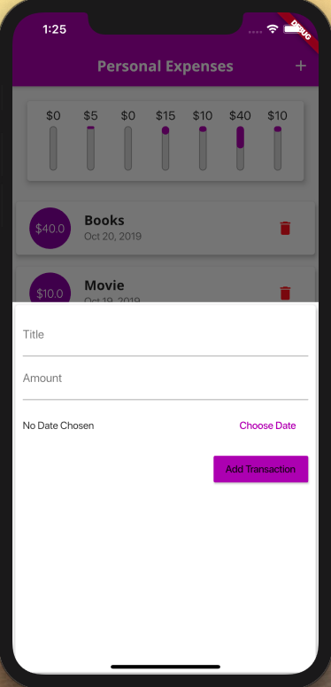

# Personal Expenses Tracker App
> A Personal Finance Tracker App for Android and iOS (also web compliant)


This application can be installed on android and iOS devices to track one's finances easily. It provides for intuitive addition and deletion of expenses with creating visual rendering.


## Installation

Clone this repository and build the application natively on your system using:  

- to build for android:
```sh
flutter build apk
```
- to build for iOS:
```sh
flutter build ios
```
- to build for the web -- rendered in any web browser:
```sh
flutter build web
```

## Usage

The application is fairly intuitive to use,expenses are listed and visualized for each week. These expenses can be added using the addition button as shown below.



## Release History

* 1.0.0
    * Initial release with documentation

## Meta

Your Name – [@vivekkaushal98](https://twitter.com/vivekkaushal98) – vivek.kaushal@outlook.com

Distributed under the MIT license. See ``LICENSE`` for more information.

[https://github.com/yourname/kaushalvivek](https://github.com/kaushalvivek/)

*Built while learning from [Maximilian Schwarzmüller's](https://twitter.com/maxedapps) Flutter course available on Udemy.*

## Contributing

1. Fork it
2. Create your feature branch (`git checkout -b feature/fooBar`)
3. Commit your changes (`git commit -am 'Add some fooBar'`)
4. Push to the branch (`git push origin feature/fooBar`)
5. Create a new Pull Request

<!-- Markdown link & img dfn's -->
[npm-image]: https://img.shields.io/npm/v/datadog-metrics.svg?style=flat-square
[npm-url]: https://npmjs.org/package/datadog-metrics
[npm-downloads]: https://img.shields.io/npm/dm/datadog-metrics.svg?style=flat-square
[travis-image]: https://img.shields.io/travis/dbader/node-datadog-metrics/master.svg?style=flat-square
[travis-url]: https://travis-ci.org/dbader/node-datadog-metrics
[wiki]: https://github.com/yourname/yourproject/wiki
